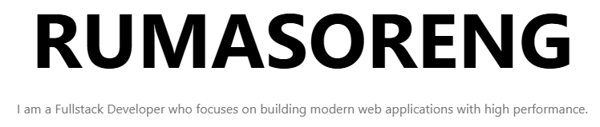

 

I'm a self-taught passionate Fullstack developer from Indonesia 

**About me**

- 💻 Fullstack Developer (Laravel + React/Next.js) passionate about building scalable web applications with clean UI and great UX.

- 🚀 Currently improving my skills through freelance projects and independent product development under [bbyts](https://github.com/bbyts).

- ❤️ I love writing TypeScript, Javascript and learning something new.

- 💬 Ask me about anything [here](https://github.com/RumasorengFadil/RumasorengFadil/issues)

- ⚡ Fun fact: I automate boring things before finishing my coffee ☕.

  
  
  
  
  
  
  

|  |  |
| ------------- | ------------- |

#### Top Repositories

 
 

#### Connect With Me

<!--  -->

